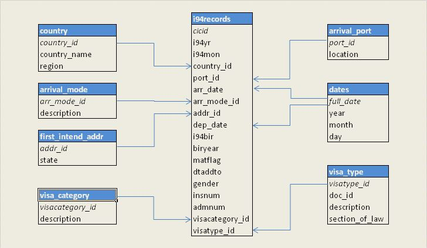
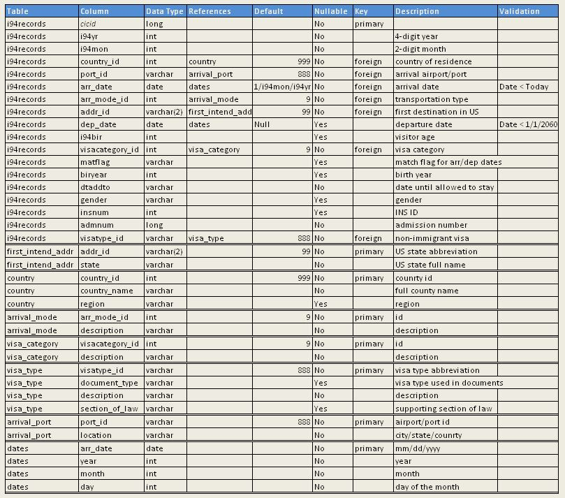

# Non-immigrant Arrivals to the U.S.

## Project Objective

The purpose of the project is to create an analytical database for statistical analysis of immigration data. This data can be  sourced from National Travel and Tourism Office (NTTO) website. The data is collected under The International Visitor Arrivals Program which provides the U.S. government and the public with the official monthly and annual overseas visitor arrivals to the United States. NTTO manages the program in cooperation with the Department of Homeland Security, Customs and Border Protection (CBP). Apart from the U.S. Government, the summarized data can be used by airlines, airports, U.S. destinations - state and city, major attractions, state governments and consultants.

Once initial data in transformed into data model described in the sections below, it will be possible to aggregate the immigration data by various fields and to present it to all interested parties. Potential aggregation fields include

- port of entry to the U.S.
- mode of arrival/transportation
- the first destination in the U.S.
- visa type
- visitors' age

## Data Sources

|      Dataset     	               | Udacity       |                 Additional Data from Internet                                          |
|:-------------------------------: |:----------:   |:----------------------------------------------------------------:                      |
| Non-resident arrivals to the U.S.| yes           |                      | 
| Airports and ports               | yes           | https://datahub.io/core/airport-codes#data                                             |
| Country and region of residence  | yes           | https://travel.trade.gov/research/programs/i94/1999-2018%20Region%20Dictionary.xlsx    |
| Arrival mode                     | yes           |                                                                                        |
| U.S. destination (state only)    | yes           |                                                                                        |
| Visa category                    | yes           |                                                                                        |
| Visa type                        | no            | https://www.uscis.gov/ilink/docView/AFM/HTML/AFM/0-0-0-1/0-0-0-27276/0-0-0-32908.html  |
|                                  |               | https://travel.trade.gov/research/programs/i94/methodology.asp                         |
|                                  |               |                                                                                        |

- _Ports of Entry_: data provided by Udacity was combined with supplementary data using the code.
- _Country and region of residence_: region was added to the country data provided by Udacity.
- _Visa type_: only the data from 2 online data sources was used.

## *Data Model*

- Database is normalized to the third normal form.
- Database is represented by a Star schema
  
### *Fact Table*

- **i94records** - Non-Immigrant I-94 Arrival/Departure Records as of 2016
  
### *Dimension Tables*

- **country** - visitor's country of residence
- **arrival_port** - airport/port of arrival
- **arrival_mode** - means of transportation (air/land/sea)
- **first_intend_addr** - destination US state
- **visa_category** - general visa category (business/pleasure/student)
- **visa_type** - specific visa types and supporting sections of law
- **dates** - date definitions

### *Data Dictionary*

## ETL Process

### Tools

Reading, processing and saving data is done by **Apache Spark** via _PySpark_ library. Spark was selected as a tool for this project due to the following features:

- quick installation
- fairly easy to use
- low-latency in-memory data processing
- highly scalable
- support for muptiple programming languages inlcuding Python that was used for this project
- incorporating SQL directly into the code
- functional programming

### Steps

#### Dimension tables

1. Read data for all dimenstion tables except _dates_ table from corresponding csv files.
2. Merge 2 datasets for ports of entry via outer join on port_id. Pick a non-null port location from either source. If location in one of the sources has _No Port_ or _Collapsed_ then take a valid port location from another source.
3. Clean up dimension tables:
    - remove duplicate rows
    - check primary key column for NULL values
    - remove records with primary key = NULL if any
4. Check uniqueness of primary key by counting total and distinct key values
5. Save dimension tables as json files.

#### Fact table

1. Read monthly data files in sas format. For each input file perform the following steps.
2. Count number of rows to be compared to the number of output rows at the end.
3. Clean up **primary** key:
    - remove duplicate rows
    - check primary key column for NULL values
    - remove records with primary key = NULL if any

4. Clean up **foreign** keys. For each foreign key:
    - count NULL values, save this count to be compared to the similar count after the data was transformed
    - replace NULL values with a default value shown in data dictionary  
    - check correctness of values
      - for non-date columns:
        - perform a left join with a corresponding dimenstion table
        - any values that were not found in dimension table are considered incorrect and should be replaced by a default value
      - for date columns:
        - compare date against upper date limit. Arrival date should be before today's date and departure date should be before 1/1/2060 (an arbitrary date in the future)
        - arrival date cannot be Null while departure date can be

5. Fix incorrect values in foreign key columns found in step 4. Replace them with correct default values outlined in the data dictionary.
6. Convert arrival and departure date columns from SAS format to regular date format (date = 1/1/1960 + SAS date)
7. Drop the original foreign key columns since checking correctness, fixing incorrect values and converting dates to a new format resulted in creating new foreign key columns.

8. Validate foreign key columns after data was processed
    - Count NULL values again
    - Only departure date column can contain NULL values

9. Create date dimenstion table by selecting distinct arrival dates from fact table
    - add year, month, day of the month column by extracting them from the date column
    - save date table as json file

10. Count number of rows to be compared to the original number of input rows as a completeness test.

11. Save fact table as json file

### Summary of integrity checks

1. Dimension tables:
   - duplicate rows
   - primary key: non-null and uniqueness conditions
2. Fact table:
   - completeness check, rows count before and after
   - primary key: non-null condition
   - foreign keys:
     - non-null if applicable
     - consistency against referenced dimension table (incorrect values are replaced with a default value)
     - dates are within meaningful limits
     - dates are converted from SAS to regular format

## Potential future enhancements

1. If the data was increased by 100x.

    _Spark should be able to handle the data size increase. The output data should be saved in Redshift or other database in the cloud_

2. If the pipelines were run on a daily basis by 7am.

    _Airflow can be used to schedule Service Level Agreement (SLA) data delivery time_.
_Each pipeline function call can become an Airflow operator and the sequence of function calls can be converted into a DAG_

3. If the database needed to be accessed by 100+ people.

    _The output data can be saved in Redshift or another database that controls data access_

## Files in Repository

|      File Name     	|                 Description                  |
|:------------------:	|:-----------------------------------------:   |
| `etl.py`           	| complete ETL process                	       |
| `dl.cfg`          	| config file with AWS credentials             |
| `README.md`        	|                                              |
| `star_schema.jpg`     | image for README file                        |
| `data_dict.jpg`       | image for README file                        |
| `dim_data` folder     | input data for all dimension tables          |
| `fact_data` folder    | input data for fact tables (TEST only)       |
| `output_data` folder  | output data for all tables (TEST only)       |

## Running ETL pipeline

1. Add AWS credentials to dl.cfg
2. Specify S3 bucket and S3 folder in main() tos save output data in S3 if using 'onefile' or 'allfiles' parameter
3. Command line: 
4. `python ./etl.py test`  - to run using a fact table with 1,000 rows
5. `python ./etl.py onefile`  - to run using a fact table with ~4 million rows
6. `python ./etl.py allfiles`  - to run using 12 fact table with ~2-4 million rows in each file
